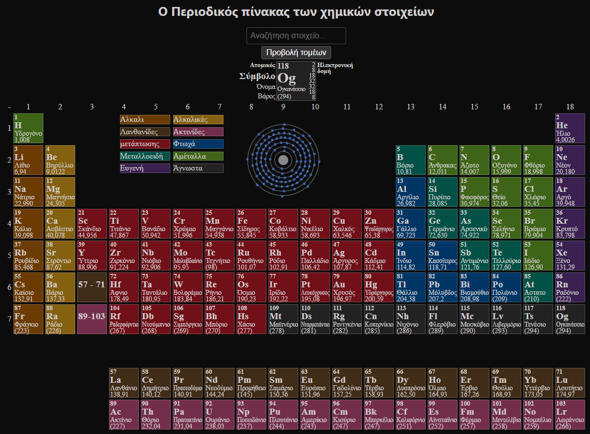
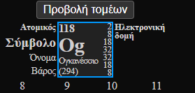
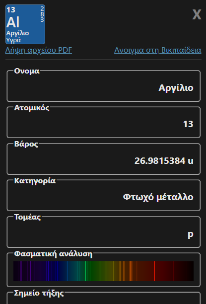
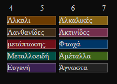
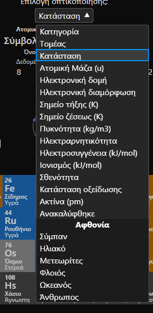
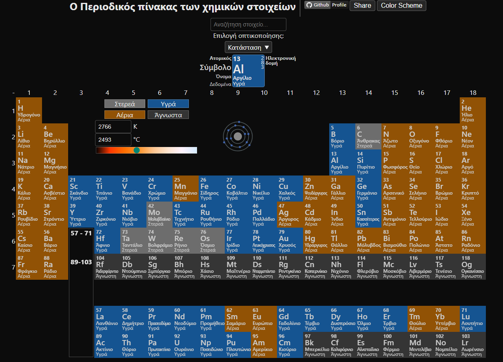

[](https://creativecommons.org/licenses/by-nc-nd/4.0/)

[Ελληνικά](README.md) | [日本語](README.ja.md) | English

# My Periodic Table

https://stefalgo.github.io/My-Periodic-Table

## All 118 Elements



You can view all 118 chemical elements in the periodic table. By clicking on an element preview,

more information about that element will appear, such as its name, symbol (short name), atomic number, etc.

Clicking on the preview in this window will open the element's Wikipedia PDF.





## Visualizations



You can hover over these boxes to highlight the elements belonging to the corresponding category.

You can also use the dropdown menu to select other visualizations.





# JSON Data

## Element Data Sources

[https://github.com/Bowserinator/Periodic-Table-JSON](https://github.com/Bowserinator/Periodic-Table-JSON)

[https://pse-info.de](https://pse-info.de)

[https://wikipedia.org](https://wikipedia.org)

The data is combined into a single file.

Currently in use: `JsonData/ElementsV6.json` and `JsonData/spectrum.json`

## Format of ElementsV5.json

```jsonc
{
    "1": {
        "atomic": 1,
        "symbol": "H",
        "name": "Hydrogen",
        "atomicMass": 1.008,
        "electronConfiguration": "1s1",
        "electronStringConf": "1s1",
        "electronegativity": 2.2,
        "atomicRadius": 53,
        "ionizationEnergy": 1312.0,
        "electronAffinity": 72.8,
        "oxidation": "-1c,1c",
        "melt": 14.01,
        "boil": 20.28,
        "valence": 1,
        "density": 0.0899,
        "quantum": {
            "l": 0,
            "m": 0,
            "n": 1
        },
        "elementAbundance": {
            "universe": "75",
            "solar": "75",
            "meteor": "2.4",
            "crust": "0.15",
            "ocean": "11",
            "human": "10"
        },
        "heatCap": 14300,
        "thermalConductivity": 0.1805,
        "category": "nonmetal",
        "period": 1,
        "group": 1,
        "discovered": "1766"
    },

    //...
}
```

## Format spectrum.json
spectrum.json is storing the element spectrum images in base64 format of 1px height\
this allows to embed images much easier instead of having a folder full of those images\
and by streching the height to something like 40px it will make the spectrum image more visible\

The spectrum.json is from the [https://pse-info.de](https://pse-info.de) and is it used as its own file.
```jsonc
{
    "h":"data:image/png;base64,iVBORw0KGgoAAAANSUhEUgAABAAAAAABCAIAAADPbEtiAAAA80lEQVRIx+2UTw7BUBDGf++9ioRYiIiVRCxcxS1cwDlcwtbW3g0sXYArkJAg8W+s0KevtFWpRJumb76Zb7558y2qSlR5PMofaTyP4oE9iJPgPz2KhsKBrYQQ3ipoTJn6jtWZY0SFG3giBKeoQFnXaINesgCJo6BcnE+rKlGvwnToVWjNGFw43cviI4vdK7ZCCASU2G68gK4R7olirxAOrRVc8O0Kjo2sU/mCWPCTLm3oTjAw7bOef2tWiheOBOXm9NMbPfkj5IgKCZ3L8878w+CsvukKBn588TKZ0P5Jv+ExagIMl4w3/2KjxA++wczFf+0aVy1Z9wfkGdqJAAAAAElFTkSuQmCC",
    //...
}
```

# Author
(c) 2025 [@stefalgo](https://github.com/stefalgo). Licensed under Creative Commons Attribution-NonCommercial-NoDerivatives 4.0 International [CC BY-NC-ND 4.0](./LICENSE.md).
