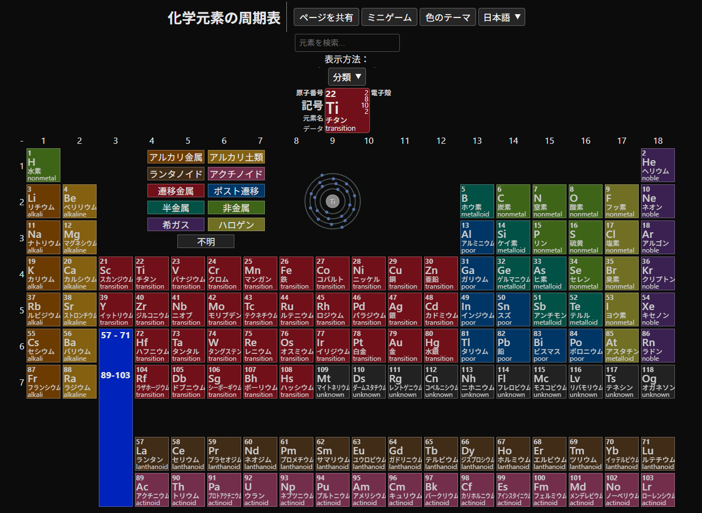
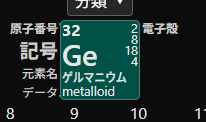
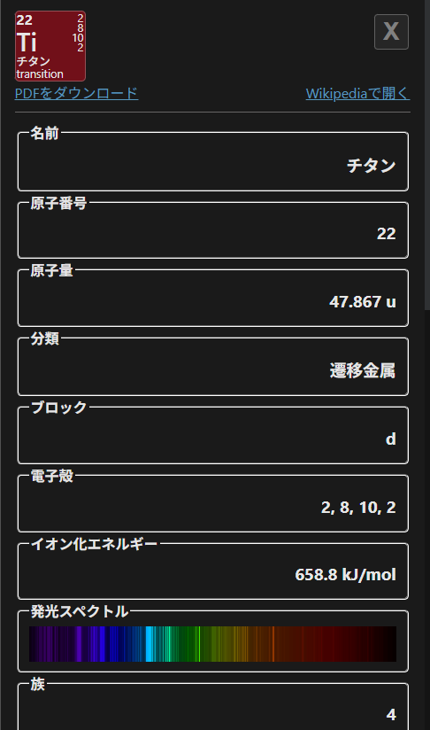
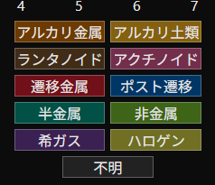
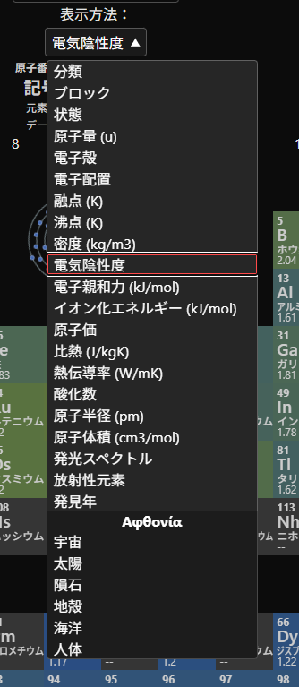
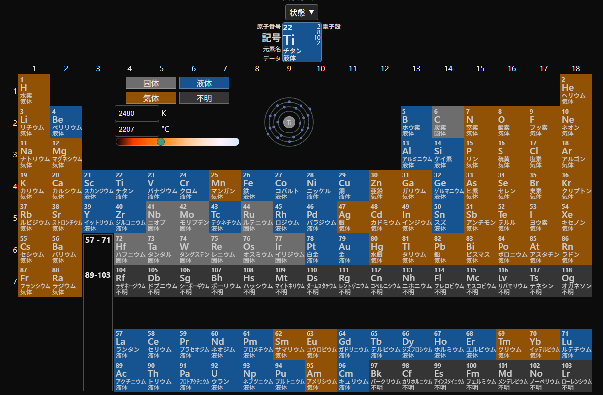

[](https://creativecommons.org/licenses/by-nc-nd/4.0/)

[Ελληνικά](README.md) | 日本語 | [English](README.en.md)

# My Periodic Table

https://stefalgo.github.io/My-Periodic-Table

## 全118元素



周期表では、全118元素の化学元素を見ることができます。元素のプレビューをクリックすると、

その元素について、名前、元素記号（略称）、原子番号など、より詳しい情報が表示されます。

このウィンドウ内のプレビューをクリックすると、その元素のWikipediaのPDFが開きます。





## 可視化



これらのボックスにマウスを合わせると、それぞれのカテゴリーに属する元素がハイライトされます。

また、ドロップダウンメニューから他の表示方法を選択することもできます。





# JSONデータ

## 元素データの出典

[https://github.com/Bowserinator/Periodic-Table-JSON]

https://pse-info.de

https://wikipedia.org

データは1つのファイルにまとめられています。

現在使用しているファイル: `JsonData/ElementsV6.json` と `JsonData/spectrum.json`

## ElementsV5.jsonの形式

```jsonc
{
    "1": {
        "atomic": 1,
        "symbol": "H",
        "name": "Hydrogen",
        "atomicMass": 1.008,
        "electronConfiguration": "1s1",
        "electronStringConf": "1s1",
        "electronegativity": 2.2,
        "atomicRadius": 53,
        "ionizationEnergy": 1312.0,
        "electronAffinity": 72.8,
        "oxidation": "-1c,1c",
        "melt": 14.01,
        "boil": 20.28,
        "valence": 1,
        "density": 0.0899,
        "quantum": {
            "l": 0,
            "m": 0,
            "n": 1
        },
        "elementAbundance": {
            "universe": "75",
            "solar": "75",
            "meteor": "2.4",
            "crust": "0.15",
            "ocean": "11",
            "human": "10"
        },
        "heatCap": 14300,
        "thermalConductivity": 0.1805,
        "category": "nonmetal",
        "period": 1,
        "group": 1,
        "discovered": "1766"
    },
    //...
}
```

## spectrum.jsonの形式

spectrum.jsonには、元素のスペクトル画像が高さ1pxのBase64形式で保存されています。

これにより、スペクトル画像をそれぞれ別のフォルダに保存するよりも、簡単に画像を埋め込むことができます。

高さを40px程度に引き伸ばすことで、スペクトル画像をより見やすく表示できます。

spectrum.jsonは「https://pse-info.de」のデータを使用しており、独立したファイルとして使用されています。

```jsonc
{
    "h":"data:image/png;base64,iVBORw0KGgoAAAANSUhEUgAABAAAAAABCAIAAADPbEtiAAAA80lEQVRIx+2UTw7BUBDGf++9ioRYiIiVRCxcxS1cwDlcwtbW3g0sXYArkJAg8W+s0KevtFWpRJumb76Zb7558y2qSlR5PMofaTyP4oE9iJPgPz2KhsKBrYQQ3ipoTJn6jtWZY0SFG3giBKeoQFnXaINesgCJo6BcnE+rKlGvwnToVWjNGFw43cviI4vdK7ZCCASU2G68gK4R7olirxAOrRVc8O0Kjo2sU/mCWPCTLm3oTjAw7bOef2tWiheOBOXm9NMbPfkj5IgKCZ3L8878w+CsvukKBn588TKZ0P5Jv+ExagIMl4w3/2KjxA++wczFf+0aVy1Z9wfkGdqJAAAAAElFTkSuQmCC",
    //...
}
```

# 作者

(c) 2025 [@stefalgo](https://github.com/stefalgo). Licensed under Creative Commons Attribution-NonCommercial-NoDerivatives 4.0 International [CC BY-NC-ND 4.0](./LICENSE.md).
