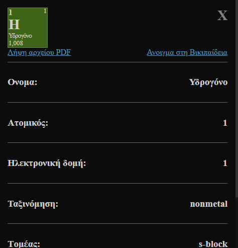
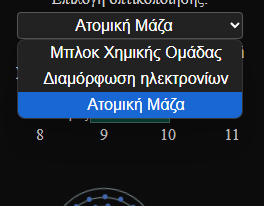
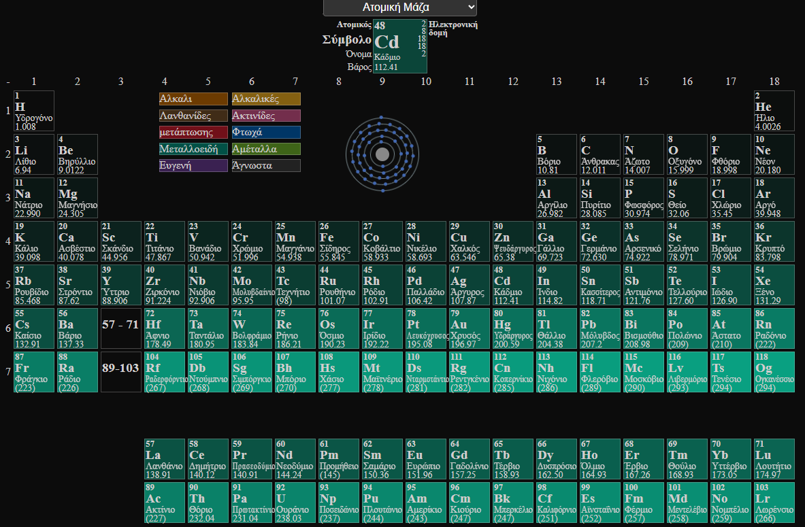

[](https://creativecommons.org/licenses/by-nc-nd/4.0/)

# My Periodic Table
https://stefalgo.github.io/My-Periodic-Table

## Όλα τα 118 στοιχεία
\
Μπορείτε να δείτε όλα τα 118 χημικά στοιχεία στον πίνακα και κάνοντας κλικ στην προεπισκόπηση του στοιχείου,\
θα εμφανιστούν περισσότερες πληροφορίες για αυτό το στοιχείο, όπως το όνομα, το σύμβολο (σύντομο όνομα), ο ατομικός αριθμός κ.ά.\
Εάν κάνετε κλικ στην προεπισκόπηση αυτού του παραθύρου, θα ανοίξει το PDF του στοιχείου από τη Wikipedia.
\



## Οπτικοποίησης
\
Μπορείτε να περάσετε το ποντίκι πάνω από αυτά τα κουτάκια για να επισημάνετε τα στοιχεία της αντίστοιχης κατηγορίας.

Επίσης, μπορείτε να πατήσετε το αναπτυσσόμενο πλαίσιο για να επιλέξετε άλλες απεικονίσεις\
\


# JSON Data
## Πηγές δεδομένων στοιχείων
[https://github.com/Bowserinator/Periodic-Table-JSON](https://github.com/Bowserinator/Periodic-Table-JSON)\
[https://ptable.com](https://ptable.com)\
[https://wikipedia.org](https://wikipedia.org)

Data are combined into 1 file.\
Current: `JsonData/ElementsV4.json`
## Format
```jsonc
{
    "1": {
        "atomic": 1,
        "symbol": "H",
        "name": "Υδρογόνο",
        "atomicMass": 1.008,
        "electronConfiguration": "1s1",
        "electronStringConf": "1s1",
        "electronegativity": 2.2,
        "atomicRadius": 53,
        "ionizationEnergy": 1312.0,
        "electronAffinity": 72.8,
        "oxidation": "-1c,1c",
        "melt": 14.01,
        "boil": 20.28,
        "valence": 1,
        "density": 0.0899,
        "quantum": {
            "l": 0,
            "m": 0,
            "n": 1
        },
        "elementAbundance": {
            "universe": "75",
            "solar": "75",
            "meteor": "2.4",
            "crust": "0.15",
            "ocean": "11",
            "human": "10"
        },
        "category": "nonmetal",
        "period": 1,
        "discovered": "1766"
    },
    //...
}
```

# Author
&copy; 2025 [@stefalgo](https://github.com/stefalgo) **All Rights Reserved.**
